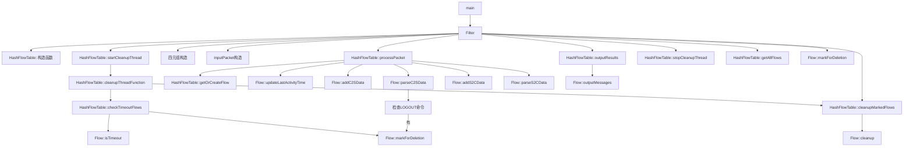

# main_of_0x12.cpp 函数调用流程图

## 整体流程概述

`main_of_0x12.cpp`中实现了一个基于四元组的IMAP流量处理系统。整个流程分为以下几个主要步骤：

1. 程序入口与初始化
2. 创建流表与启动清理线程
3. 构造四元组与数据包
4. 处理数据包
5. 输出处理结果
6. 资源清理与释放

## 函数调用链



## 详细步骤说明

### 1. 程序入口与初始化

```
main()
  └── 创建TASK结构体，设置Inform=0x12
  └── 调用Filter(&task, nullptr)
```

### 2. 创建流表与启动清理线程

```
Filter()
  └── 检查Inform字段(0x12表示数据传输)
  └── 创建HashFlowTable对象
      └── HashFlowTable::构造函数 - 初始化流表
  └── 启动清理线程
      └── HashFlowTable::startCleanupThread(5, 120)
          └── 创建新线程运行cleanupThreadFunction
              └── 线程内定期执行:
                  ├── checkTimeoutFlows - 检查流是否超时(120秒无活动)
                  │   └── Flow::isTimeout - 检查流活动时间
                  │   └── Flow::markForDeletion - 标记超时流
                  └── cleanupMarkedFlows - 清理已标记的流
```

### 3. 构造四元组与数据包

```
Filter()
  └── 根据TASK中的源端和宿端信息创建FourTuple
      ├── 设置源IP和端口 (根据IPvN版本区分IPv4/IPv6)
      └── 设置目标IP和端口 (根据IPvN版本区分IPv4/IPv6)
  └── 创建InputPacket
      ├── 设置payload(从TASK的Buffer和Length构造)
      ├── 设置type(根据Source.Role确定C2S/S2C)
      └── 设置fourTuple
```

### 4. 处理数据包

```
Filter()
  └── 调用flowTable.processPacket(packet)
      └── 根据四元组获取或创建Flow对象
          └── HashFlowTable::getOrCreateFlow(fourTuple)
              ├── 计算四元组哈希值
              ├── 查找已存在的流
              ├── 如果未找到，创建反向四元组并查找
              └── 如果两种方向都未找到，创建新Flow对象
      └── 更新流的最后活动时间
          └── Flow::updateLastActivityTime()
      └── 根据数据包类型处理数据
          ├── C2S类型:
          │   ├── Flow::addC2SData - 向C2S缓冲区添加数据
          │   └── Flow::parseC2SData - 解析C2S数据
          │       └── 检查是否有LOGOUT命令，有则标记流可删除
          └── S2C类型:
              ├── Flow::addS2CData - 向S2C缓冲区添加数据
              └── Flow::parseS2CData - 解析S2C数据
```

### 5. 输出处理结果

```
Filter()
  └── 如果数据包处理成功
      └── 输出所有已解析的消息
          └── HashFlowTable::outputResults()
              └── 遍历所有流，调用Flow::outputMessages()
```

### 6. 资源清理与释放

```
Filter()
  └── 停止清理线程
      └── HashFlowTable::stopCleanupThread()
  └── 获取所有流并标记为删除
      └── HashFlowTable::getAllFlows()
      └── 遍历并调用Flow::markForDeletion()
  └── 手动清理所有标记的流
      └── HashFlowTable::cleanupMarkedFlows()
          └── 查找所有标记为删除的流
          └── 从流映射表中删除
          └── 调用Flow::cleanup() - 清理流资源
          └── 删除流对象
```

## 三种流删除机制

系统实现了三种流删除机制，确保资源能够及时释放：

1. **基于LOGOUT命令的删除**：
   - 在`Flow::parseC2SData()`中检测LOGOUT命令
   - 发现LOGOUT命令时调用`markForDeletion()`标记流可删除

2. **基于超时的删除**：
   - 在清理线程中定期调用`checkTimeoutFlows()`检查流是否超时
   - 超过120秒没有活动的流被标记为可删除

3. **手动资源清理**：
   - 在程序结束前调用`stopCleanupThread()`停止清理线程
   - 手动标记所有流为可删除并清理

## 线程安全考虑

所有涉及流映射表的操作都通过互斥锁保护，确保在多线程环境下的数据一致性：

- `flowMapMutex`用于保护`flowMap`数据结构
- 所有读写流映射表的方法都使用`std::lock_guard<std::mutex>`加锁
- 清理线程通过`stopThread`原子变量控制启停