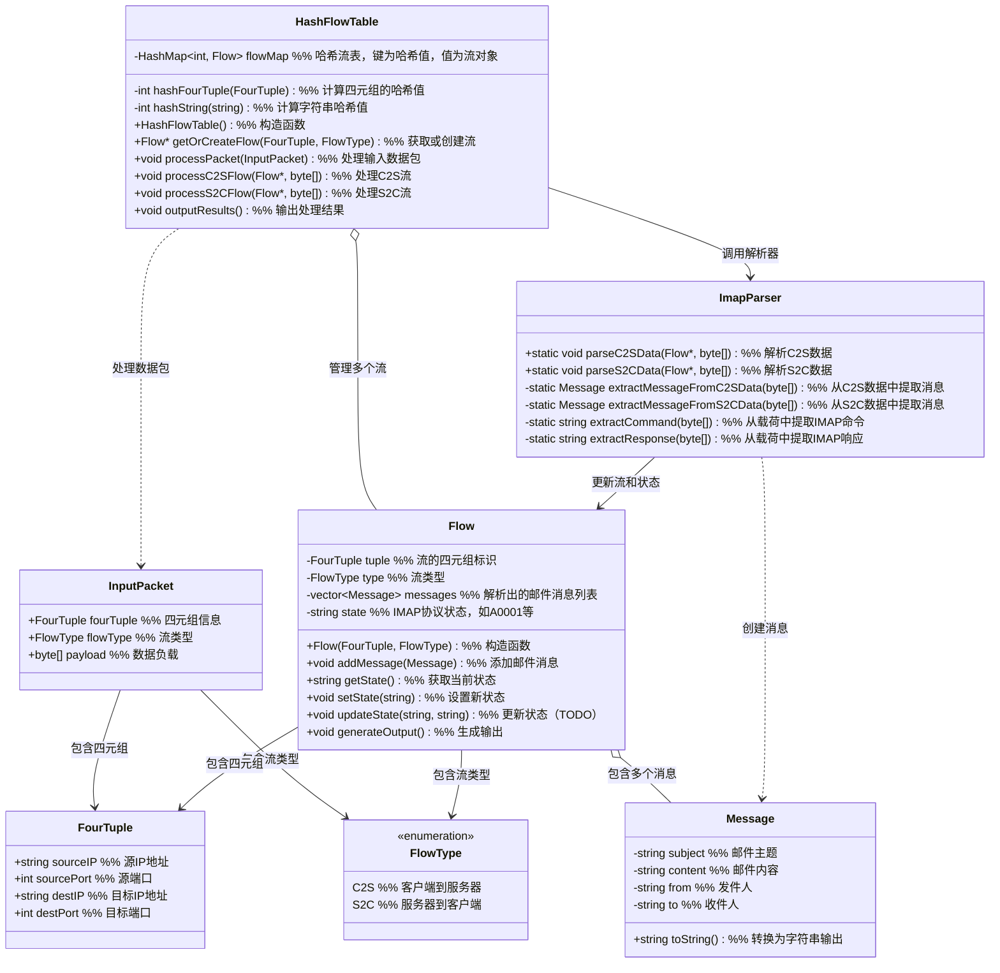
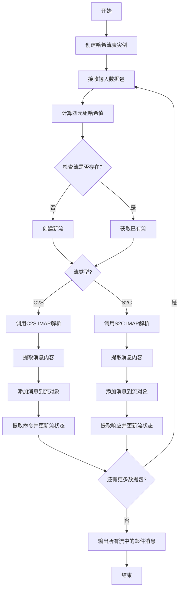

# 哈希流表设计图

## 类关系图



## 处理流程图



## 数据流向图

```mermaid
flowchart LR
    input[输入数据包\nInputPacket] --> hash[哈希流表\nHashFlowTable]
    hash --> flow[流对象\nFlow]
    flow --> parser[IMAP解析器\nImapParser]
    parser --> msg[邮件消息\nMessage]
    parser --> state[状态更新]
    state --> flow
    msg --> flow
    flow --> output[输出邮件结果]
    
    subgraph C2S流
    c2sData[客户端命令数据] --> c2sCmd[提取命令] --> c2sParse[C2S数据解析]
    end
    
    subgraph S2C流
    s2cData[服务器响应数据] --> s2cResp[提取响应] --> s2cParse[S2C数据解析]
    end
    
    c2sParse --> parser
    s2cParse --> parser