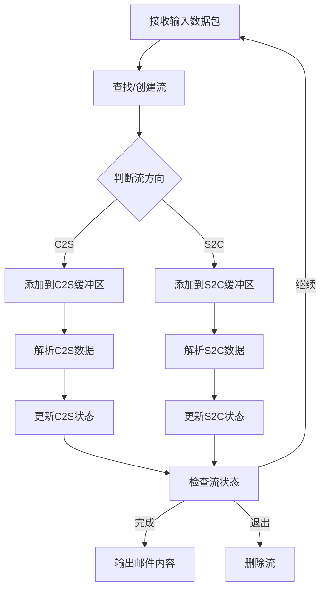

# IMAP流量处理工作流程

本文档描述了基于四元组的IMAP流量处理工作流程，包括数据接收、流表管理、数据解析与状态维护以及结果输出等环节。

## 1. 总体处理流程



## 2. 数据接收与流表管理

### 2.1 数据接收

系统接收`InputPacket`类型的数据包，每个数据包包含：
- 四元组（源IP、源端口、目标IP、目标端口）
- 负载数据(payload)
- 唯一标识ID

### 2.2 流表管理

1. 使用`HashFlowTable`类管理所有流：
   - 接收输入数据包
   - 计算四元组哈希值
   - 查找或创建对应的流对象

2. 流创建过程：
   - 如果四元组哈希值不存在，创建新的`Flow`对象
   - 初始化流的两个方向(C2S和S2C)的缓冲区和状态

3. 流查找过程：
   - 如果四元组哈希值已存在，返回对应的`Flow`对象
   - 根据数据包的方向，选择将数据添加到C2S或S2C缓冲区

4. 流删除策略：
   - 检测到LOGOUT命令并确认执行完成后删除流
   - 流超时（长时间无数据交换）后自动删除

## 3. 数据解析与状态维护

### 3.1 数据缓冲

每个`Flow`对象维护两个`CircularString`类型的环形缓冲区：
- C2S缓冲区：存储客户端到服务器的数据
- S2C缓冲区：存储服务器到客户端的数据

环形缓冲区具有以下特性：
- 固定容量，满时自动覆盖最旧数据
- 支持查找字符串、提取子串、删除前N个字符等操作

### 3.2 IMAP命令解析

C2S方向解析流程：
1. 将数据添加到C2S缓冲区
2. 在缓冲区中查找完整的IMAP命令（通常以"\r\n"结尾）
3. 解析命令格式（通常为"TAG COMMAND [ARGS]"）
4. 创建`Message`对象存储解析结果
5. 更新C2S状态

### 3.3 IMAP响应解析

S2C方向解析流程：
1. 将数据添加到S2C缓冲区
2. 在缓冲区中查找完整的IMAP响应
3. 解析响应内容（可能包含邮件内容、状态码等）
4. 从响应中提取邮件信息，创建`email`对象
5. 更新S2C状态

### 3.4 状态维护

每个`Flow`对象维护两个方向的状态：
- C2S状态：记录当前客户端命令的处理阶段
- S2C状态：记录当前服务器响应的处理阶段

状态变迁例子：
- LOGOUT命令发送 -> 等待响应 -> 接收到LOGOUT响应 -> 标记流可删除
- SELECT命令发送 -> 等待响应 -> 接收到SELECT响应 -> 更新当前邮箱

## 4. 结果输出

### 4.1 邮件处理

1. 从IMAP响应中提取邮件相关字段：
   - 发件人(from)
   - 收件人(to)
   - 主题(subject)
   - 内容(content)
   - 日期(date)
   - 唯一标识(uid)
   - 标志(flags)
   - 状态(state)
   - 标识(id)

2. 将提取的邮件存储在对应的`Flow`对象中

### 4.2 结果输出

当检测到流程结束（如LOGOUT命令完成）或按需输出时：
1. 遍历所有流
2. 对每个流，输出C2S和S2C方向解析出的所有邮件
3. 生成格式化的输出结果

## 5. 错误处理与异常情况

1. 数据不完整：
   - 保持数据在缓冲区直到接收到完整命令/响应
   - 使用超时机制处理长时间不完整的数据

2. 协议解析错误：
   - 记录错误信息
   - 尝试恢复到已知状态
   - 如无法恢复，可能需要丢弃当前流

3. 资源管理：
   - 定期清理长时间不活跃的流
   - 限制单个流的缓冲区大小
   - 监控总内存使用情况

## 6. 主程序实现伪代码

以下是main.cpp的伪代码实现，展示了完整的工作流程：

```cpp
// main.cpp 伪代码实现
#include <iostream>
#include <vector>
#include <string>
#include <unordered_map>
#include "flow_table.h"
#include "circular_string.h"
#include "imap_parser.h"

// 模拟数据包输入函数
std::vector<InputPacket> readInputPackets(const std::string& filename) {
    std::vector<InputPacket> packets;
    // 从文件读取数据包
    // ...
    return packets;
}

int main(int argc, char* argv[]) {
    // 1. 检查命令行参数
    if (argc < 2) {
        std::cerr << "用法: " << argv[0] << " <输入文件路径>" << std::endl;
        return 1;
    }
    
    // 2. 读取输入数据包
    std::vector<InputPacket> packets = readInputPackets(argv[1]);
    std::cout << "读取到 " << packets.size() << " 个数据包" << std::endl;
    
    // 3. 创建哈希流表
    HashFlowTable flowTable;
    
    // 4. 处理所有数据包
    for (const auto& packet : packets) {
        // 打印处理进度
        std::cout << "处理数据包: " << packet.id << std::endl;
        
        // 获取或创建流
        Flow* flow = flowTable.getOrCreateFlow(packet.fourTuple);
        
        // 根据数据包方向处理
        if (isC2SPacket(packet)) {
            // 添加数据到C2S缓冲区
            flow->addC2SData(packet.payload);
            
            // 解析C2S数据
            while (true) {
                // 尝试从缓冲区中提取完整的IMAP命令
                std::string command = extractNextCommand(flow->getC2SBuffer());
                if (command.empty()) {
                    break; // 没有更多完整命令
                }
                
                // 解析命令
                Message msg = parseIMAPCommand(command);
                
                // 添加到消息列表
                flow->addC2SMessage(msg);
                
                // 更新C2S状态
                flow->updateC2SState(msg);
                
                // 检查是否为LOGOUT命令
                if (isLogoutCommand(msg)) {
                    flow->markForDeletion();
                }
            }
        } else {
            // 添加数据到S2C缓冲区
            flow->addS2CData(packet.payload);
            
            // 解析S2C数据
            while (true) {
                // 尝试从缓冲区中提取完整的IMAP响应
                std::string response = extractNextResponse(flow->getS2CBuffer());
                if (response.empty()) {
                    break; // 没有更多完整响应
                }
                
                // 解析响应
                Message msg = parseIMAPResponse(response);
                
                // 添加到消息列表
                flow->addS2CMessage(msg);
                
                // 更新S2C状态
                flow->updateS2CState(msg);
                
                // 检查响应中是否包含邮件内容
                if (containsEmailData(msg)) {
                    email emailObj = extractEmailFromMessage(msg);
                    flow->addEmail(emailObj);
                }
            }
        }
    }
    
    // 5. 清理标记为删除的流
    flowTable.cleanupMarkedFlows();
    
    // 6. 输出结果
    std::cout << "开始生成结果..." << std::endl;
    flowTable.outputResults();
    
    // 7. 统计信息
    std::cout << "处理完成!" << std::endl;
    std::cout << "总流数: " << flowTable.getTotalFlows() << std::endl;
    std::cout << "提取的邮件数: " << flowTable.getTotalEmails() << std::endl;
    
    return 0;
}

// 辅助函数：判断数据包方向
bool isC2SPacket(const InputPacket& packet) {
    // 根据四元组判断方向
    // 例如：如果目标端口是IMAP端口(143或993)，则为C2S方向
    return (packet.fourTuple.destPort == 143 || packet.fourTuple.destPort == 993);
}

// 辅助函数：从缓冲区提取下一个完整IMAP命令
std::string extractNextCommand(CircularString* buffer) {
    try {
        // 查找命令结束标志"\r\n"
        size_t endPos = buffer->find_nth("\r\n", 1);
        
        // 提取命令
        std::string command = buffer->substring(0, endPos + 1);
        
        // 从缓冲区中删除已处理的命令
        buffer->erase_up_to(endPos + 1);
        
        return command;
    } catch (const std::exception& e) {
        // 未找到完整命令
        return "";
    }
}

// 辅助函数：从缓冲区提取下一个完整IMAP响应
std::string extractNextResponse(CircularString* buffer) {
    // IMAP响应提取逻辑（更复杂，可能需要处理多行响应）
    // ...
    return "";
}

// 辅助函数：解析IMAP命令
Message parseIMAPCommand(const std::string& command) {
    Message msg;
    // 解析命令格式：TAG COMMAND [ARGS]
    // ...
    return msg;
}

// 辅助函数：解析IMAP响应
Message parseIMAPResponse(const std::string& response) {
    Message msg;
    // 解析响应
    // ...
    return msg;
}

// 辅助函数：检查是否为LOGOUT命令
bool isLogoutCommand(const Message& msg) {
    return (msg.command == "LOGOUT");
}

// 辅助函数：检查响应是否包含邮件数据
bool containsEmailData(const Message& msg) {
    // 检查是否包含邮件数据（如FETCH响应）
    // ...
    return false;
}

// 辅助函数：从消息中提取邮件
email extractEmailFromMessage(const Message& msg) {
    email emailObj;
    // 提取邮件字段
    // ...
    return emailObj;
}
```

上述伪代码展示了完整的IMAP流量处理工作流程，包括：
1. 读取输入数据包
2. 创建和管理流表
3. 根据数据包方向处理C2S和S2C数据
4. 解析IMAP命令和响应
5. 提取邮件内容
6. 输出处理结果

实际实现时，需要根据具体的IMAP协议细节完善命令和响应的解析逻辑，特别是多行响应和邮件内容的提取。